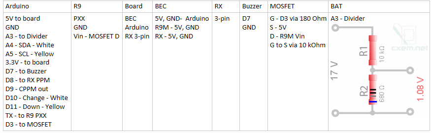

# PPM-PXX R9M Relay

RC Relay takes PPM signal from receiver and sends it to FrSky R9M module via PXX protocol. It supports up to 8 channels due to PPM protocol limitations.

The project was inspired by [PPMtoPXXArduino](https://github.com/MichaelCWarren/PPMtoPXXArduino) project from where I borrowed most of CPPM and PXX handling code.

## Features

It provides full featured control of R9M:
* binding;
* range check;
* US FCC/EU LBT/EU FLEX selection;
* power level selection;
* receiver number;
* telemetry and S.Port switches;
* enables 'No Pulses' as a most efficient type of fail-safe;

Has channel monitor (it shows current channel values and minimum/maximum per channel), voltage monitor with cell count detection, CPPM lost detection.
Provides distinctive sound signals for everything: menu buttons, low voltage, etc.
Built from Arduino Nano 328p, 128x64 I2C OLED, 2 buttons, 5V BEC, 1 p-channel MOSFET, 4 resistors and breadboard.

### RELAY feature
To enable RELAY uncomment #define RELAY in config.h.
RELAY feature provides the method to control 2 copters with single transmitter. The relay device is based on the 1st copter (relay copter) and its CPPM output acts as a receiver outpout.
PXX output goes to R9M and controls 2nd copter (remote copter). One of the channels with a switch having at least 2 positions (3 is better) provides toggling between copters.
Active copter is directly controlled by pilot, Inactive goes to GPSHOLD mode. If 3 state switch is used, middle state can force both copters perform GPSHOLD.
RELAY feature can be enabled by define RELAY in config.h, below there are parameters that should be configured accordingly.
Of course, relay copter should carry also video receiver to get video from remote copter and video transmitter to send it down to the pilot.

```C
// Enable to support RELAY mode;
#define RELAY

#define RELAY_CHANNEL    CH7  // Channel to switch between PXX and PPM control; Allowed only channels CH5..CH8;

#define GPS_MODE_CHANNEL CH8  // Set it to channel to enable GPS HOLD mode; Allowed only channels CH5..CH8;
#define GPS_HOLD_VALUE   1600 // Set it to enable GPS HOLD in GPS_MODE_CHANNEL on both relay and mission drone;

// RELAY_CHANNEL signal boundaries to enable PXX or CPPM control;
#define ACTIVE_PXX_MIN   950   // Min. value for make PXX control active;
#define ACTIVE_PXX_MAX   1350  // Max. value for make PXX control active;
#define ACTIVE_CPPM_MIN  1650  // Min. value for make CPPM control active;
#define ACTIVE_CPPM_MAX  2050  // Max. value for make CPPM control active;
```

### No-OLED mode with CLI instead
To disable OLED, comment out #define OLED in config.h.
CLI mode is opposite to OLED. In CLI mode, when RELAY is defined, it is possible to control relay mode parameters, and do the same adjustments as in OLED mode.
CLI speed is 115200, type "help" to get list of actual commands.

Because serial port in Arduino Nano is shared with PXX output, CLI needs to keep PXX disabled. 
Pin D12 controls this, if it is unconnected, PXX is working; when D12 is grounded, CLI is enabled.

## Tools needed to build

* Arduino environment 1.8.9;
* parts (see parts list below);
* soldering iron;
* "Dremel" kind rotary tool to make a case;

## Additional tools used during debugging

* Saleae8 Logic Analyzer + Logic application to see PXX, PPM, CPPM signals;
* SDR Radio dongle + SDR Sharp application to monitor transmission frequency (EU 860-868 MHz, US 900-930 MHz);
* Horus transmitter;
* Custom [scripts](tools/readme.md) from *tools* folder;

## Parts list

* Arduino Nano (328p, 5V);
* SSD1306 OLED screen (64x48, I2C);
* Any logical level p-channel MOSFET (up to 1A current), i.e. IRF9Z14; it is used to disable R9M by cutting its power off;
  Instead of MOSFET, solid-state relay or ordinary relay with transistor and diode may be used;
* Resistors 680 Ohm, 10 kOhm for voltage divider and 180 Ohm, 10 kOhm for MOSFET;
* 2 small pushbuttons;
* 5V BEC up to 1-2A current;
* breadboard, R9M connectors, battery connector (XT60), suitable case;
* 5V active beeper.
* Low-ESR capactior for R9 power filtering (see below);

## Important note about R9M power filtering

R9M with power more than 200mW emits sufficient energy to create enough noise on its own power lines.
That noise affects R9M itself, causing signal freeze and corruption. The signal from R9 receiver was extremely jerky when it happened.
I tried power it with shielded cable but it did not help. 
I realized that remedy is adding low-ESR 100uF 16V capacitor between power and ground inside the R9M module close to its power pins.
I also added parallel ceramic capacitor 0.1uF to filter high frequency noise.
And one more low-ESR 100uF 16V capacitor was added to the output of BEC to smooth out power drops on its output in the moments when relay triggers R9M on.
Without that capacitor Arduino goes to reboot when it happens.

## Arduino libraries used

* [U8g2lib](https://github.com/olikraus/u8g2 "U8g2lib")

## Custom libraries created (suitable for reuse)

* MultiTimer (.h, .cpp) - collection of software timers, flexible control over timers operation;
* Seq (.h, .cpp) - queue based beeps sequencer, individual beep sequences;
* BatteryMonitor (.h, .cpp) - provides voltage monitoring, cells count detection and low voltage alarms;

## Images

### All circuit connections


### MOSFET connection


### R9M Power consumption in Horus transmitter


### R9M pinout


### PXX sample packets


### SPort sample packets

