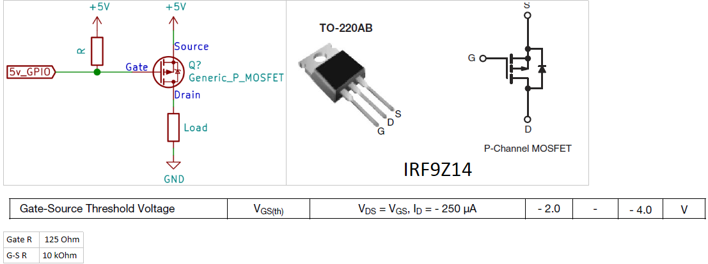

# PPM-PXX R9M Relay

RC Relay takes signal from PPM receiver and sends it to FrSky R9M module. 
The project was inspired by [PPMtoPXXArduino](https://github.com/MichaelCWarren/PPMtoPXXArduino) project from where I borrowed most of CPPM and PXX handling code.

## Features

It provides full featured control of R9M:
* binding;
* range check;
* US FCC/EU LBT/EU FLEX selection;
* power level selection;
* receiver number;
* telemetry and S.Port switches;
* enables 'No Pulses' as a most efficient type of fail-safe;

Has channel monitor, voltage monitor with cell count detection, CPPM lost detection.
Provides distinctive sound signals for everything: menu buttons, low voltage, etc.
Built from Arduino Nano 328p, 128x64 I2C OLED, 2 buttons, 5V BEC, 1 p-channel MOSFET, 2 resistors and breadboard.

## Tools needed to build

* Arduino environment 1.8.9;
* parts
* soldering iron;

## Additional tools used during debugging

* Saleae8 Logic Analyzer + Logic application;
* SDR Radio dongle + SDR Sharp application;
* Horus transmitter;
* Custom [scripts](tools/readme.md) from *tools* folder;

## Parts list

* Arduino Nano (328p, 5V);
* SSD1306 OLED screen (64x48, I2C);
* Any logical level p-channel MOSFET (up to 1A current), i.e. IRF9Z14; it is used to disable R9M by cutting its power off;
* Resistors 680 Ohm and 10 kOhm;
* 5V BEC up to 1-2A current;

## Arduino libraries used

* [U8g2lib](https://github.com/olikraus/u8g2 "U8g2lib")

## Custom libraries created (suitable for reuse)

* MultiTimer (.h, .cpp) - collection of software timers, flexible control over timers operation;
* Seq (.h, .cpp) - queue based beeps sequencer, individual beep sequences;
* BatteryMonitor (.h, .cpp) - provides voltage monitoring, cells count detection and low voltage alarms;

## Images

