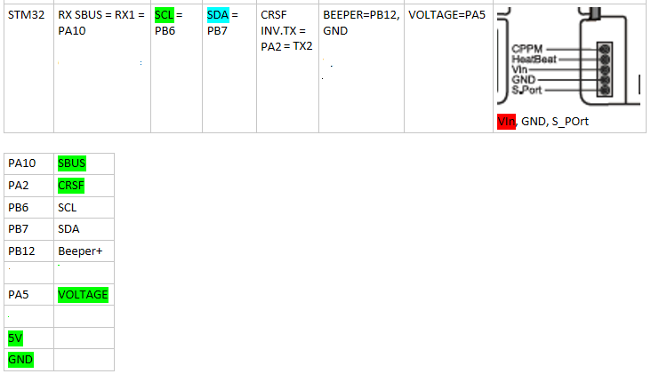
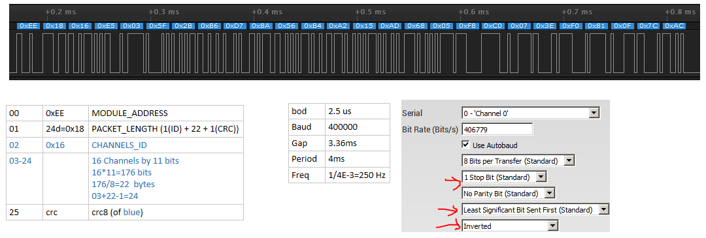

# SBUS-CRSF CrossFire Relay

RC Relay takes SBUS signal from receiver and sends it to Crossfire TX module via CRSF protocol. It supports up to 16 channels but currently Crossfire uses only 1-14 of them.

The project includes [SBUS library](https://github.com/zendes/SBUS.git), slightly improved.

## SBUS Failsafe detection

When SBUS RX goes to FS, CRSF signal generation stops to allow Crossfire RX go to FS as well. The FS detection is based on SBUS flags RX LOSS and FS.

## Channel monitor and status LED

Has channel monitor showing current channel values, voltage monitor with cell count detection, SBUS RX status and optionally SBUS frame/bytes counter.

If OLED is not attached, status LED may be used to observe SBUS RX status. Fast blinking means FS, slow flashing means RX got signal.

## Beeps

When device starts, it beeps how many cells the battery has (1-4 cells).

Besides that it provides following sound signals:
* Battery low (3.47V per cell) - BEEP_MS(200), PAUSE_MS(200), BEEP_MS(400), PAUSE_MS(200);
* Battery depleted (3.33V per cell) - BEEP_MS(200), PAUSE_MS(100), BEEP_MS(200), PAUSE_MS(100), BEEP_MS(200), PAUSE_MS(200);
* Got SBUS signal - BEEP_MS(300), PAUSE_MS(70), BEEP_MS(200), PAUSE_MS(50), BEEP_MS(100);
* Lost SBUS signal - BEEP_MS(100), PAUSE_MS(50), BEEP_MS(200), PAUSE_MS(70), BEEP_MS(300);
* Missed SBUS frame - BEEP_MS(10);
* No SBUS (periodical beep) - BEEP_MS(30),  PAUSE_MS(20), BEEP_MS(100), PAUSE_MS(50), BEEP_MS(50), PAUSE_MS(20), BEEP_MS(30);

## Hardware

Built from STM32F103C8T6 Blue Pill board, optional 128x64 I2C OLED, 5V BEC, 2 capacitors, 74HC14N, 3 resistors and breadboard.
74HC14N is used to build 2 inverters for SBUS and CRSF signals. Instead of it, inverters can be bought or made from transistors:
* Inverter cable such as http://www.expertrc.com/en/?goods=s-bus-connection-cable
* [DIY inverter](https://github.com/zendes/SBUS/blob/master/SBUS_inverter.jpeg)

## Schematic
 

## Tools needed to build

* Arduino environment 1.8.9 with STM32 support - "dan.drown.org"/"roger clark" core. "Official" stm32duino core is NOT SUPPORTED.
* parts (see parts list below);
* soldering iron;

## Additional tools used during debugging

* Saleae8 Logic Analyzer + Logic application to see SBUS and CRSF signals;
* Horus transmitter;

## Parts list

* Blue Pill STM32F103C8T6 board (20K RAM, 64k Flash);
* 74HC14N or transistors etc. for DIY inverter;
* (Optional) SSH1106 OLED screen (128*64, I2C) [i.e.](https://www.banggood.com/1_3-Inch-4Pin-White-OLED-LCD-Display-12864-IIC-I2C-Interface-Module-For-Arduino-p-1067874.html);
* Resistors 2.2 kOhm, 10 kOhm for voltage divider and 1kOhm to connect inverter output with MCU input;
* 5V BEC up to 1-2A current;
* breadboard, Crossfire TX module connectors, battery connector (XT60), suitable case;
* (Optional) Additional tantalum capacitor on the BEC input terminals and ceramic capacitor on BEC output;
* 5V active beeper.

Note: In case of using 74HC14N remember to connect ALL UNUSED INPUTS with ground, otherwise it will auto-generate and MCU may not work.

## Arduino libraries used

* [U8g2lib](https://github.com/olikraus/u8g2 "U8g2lib")

## Custom libraries created (suitable for reuse)

* MultiTimer (.h, .cpp) - collection of software timers, flexible control over timers operation;
* Seq (.h, .cpp) - queue based beeps sequencer, individual beep sequences;
* BatteryMonitor (.h, .cpp) - provides voltage monitoring, cells count detection and low voltage alarms;
* IWatchdog library ported to working core ("dan.drown.org"/"roger clark");
* SBUS library improved;
* CRSF code taken from OpenTX;

## Images

### All circuit connections

### SBUS sample packets

### CRSF sample packets

