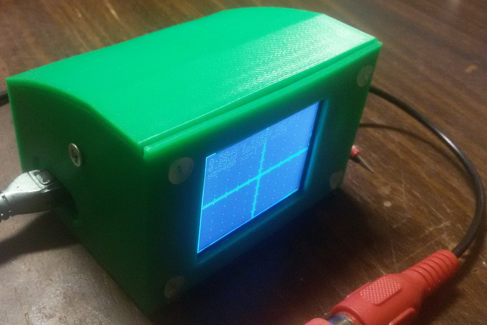
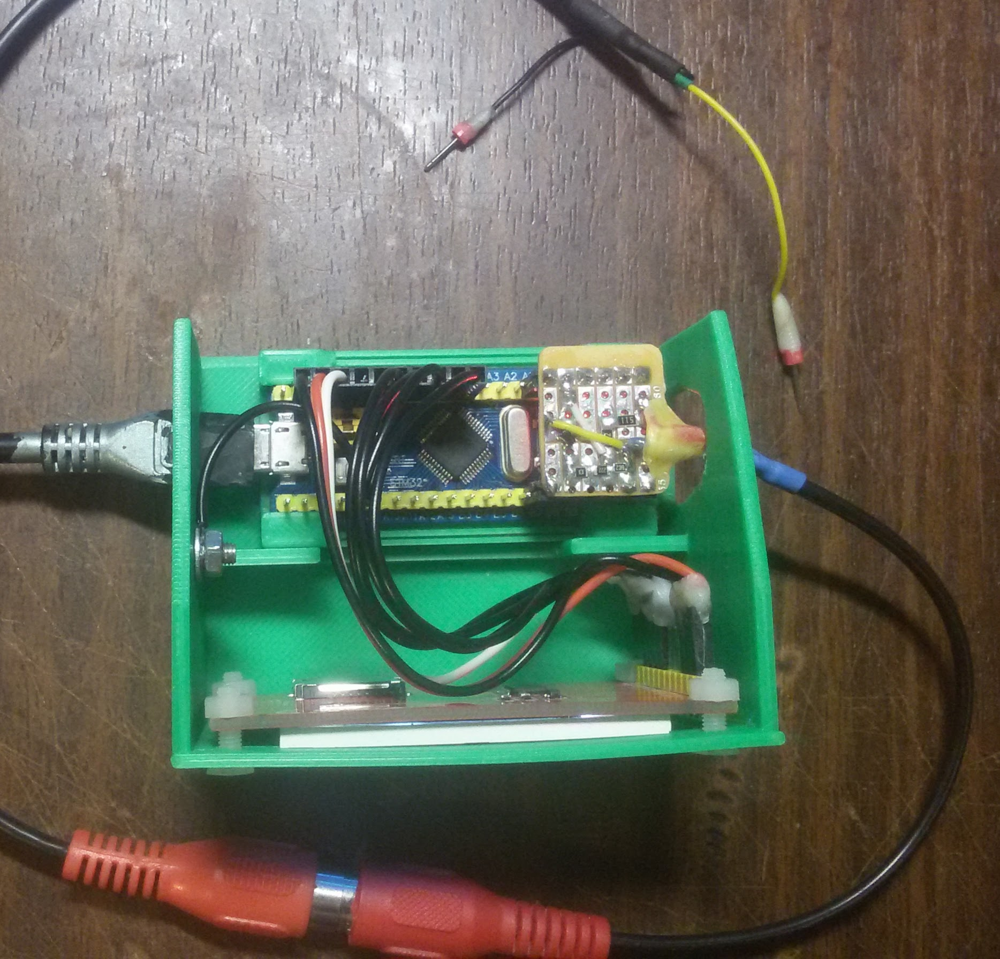
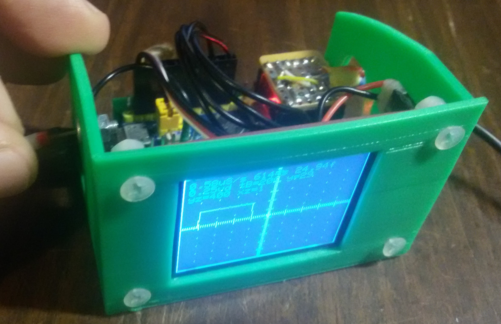

# Fork of STM32-O-Scope for ST7735 TFT 128x160 Display

## Changes

* Display changed to ST7735 1'8 TFT 128x160, i.e. https://www.banggood.com/1_8-Inch-TFT-LCD-Display-Module-SPI-Serial-Port-With-4-IO-Driver-p-1164351.html
* Pins mapping changed;
* Screen layout aligned with smaller display;
* Serial command for changing vertical scale added;
* Constant working mode without waiting for trigger signal added;
* Initial yPosition changed to put ground level to the bottom of the screen;
* Showing time removed;
* Scaling fixed;

## Commands added or modified
* ! - refresh the screen, remove artifacts;
* 0 - load initial preset of Y scale and y position (0 level is in the center);
* 3.3 - load 3.3V preset of Y scale and y position (400%/0.25V scale and 0 level is in the bottom);
* 5.0 - load 5.0V preset of Y scale and y position (400%/0.25V scale and 0 level is in the bottom);
* V - increase Y zoom factor by 10% (with numeric parameter sets the value i.e. V 200 sets Y zoom factor to 200%);
* v - decrease Y zoom factor by 10% (with numeric parameter sets the value i.e. v 200 sets Y zoom factor to 200%);
* y - moves traces down by Y (decreases Y position, with numeric parameter sets the value i.e. y -50 sets Y position down to -50); 
* Y - moves traces up by Y (increases Y position, with numeric parameter sets the value i.e. y -50 sets Y position down to -50); 
* e - additional edge type added (-1) which means do not wait for trigger and scan signal continuously (now it is set by default);

## Pins mapping

| Connection    | STM32 Pin |
| ------------- | ------------- |
| TFT_DC	| PB0 // RS |
| TFT_CS	| PB1       |
| TFT_RST	| RESET     |
| TFT_CLK	| PA5       |
| TFT_SDA	| PA7       |
| TEST_WAVE_PIN	| PA8	    |
| analogInPin 	| PA0       |

## Case model:

* [STM32 BluePill Oscilloscope Case for ST7735 TFT 128x160 Display](https://www.thingiverse.com/thing:4035217)

## Pics

